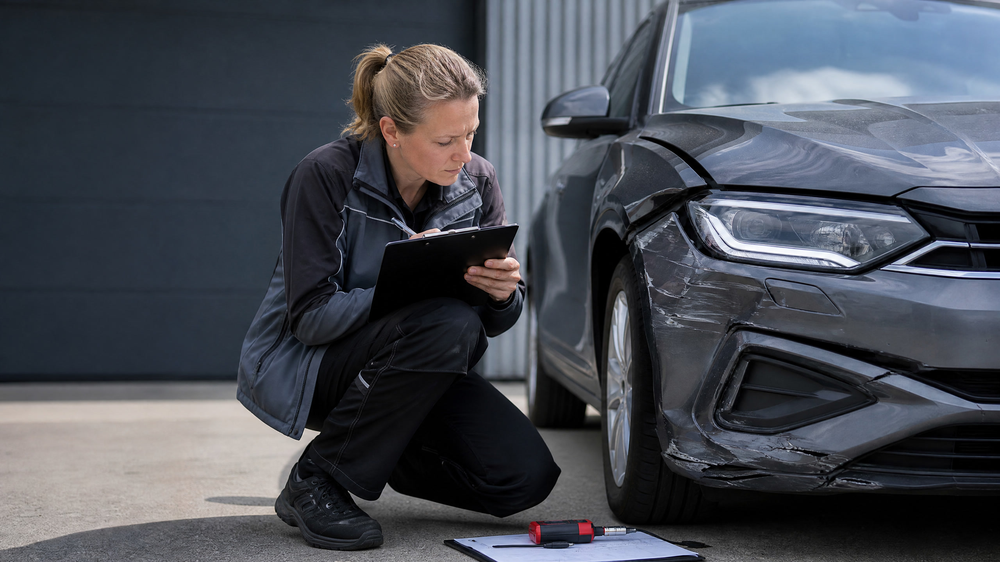

# Kfz-Gutachten: Wann es sinnvoll ist, was es kostet und wer zahlt

Ein Kfz-Gutachten dokumentiert den Zustand, den Wert oder einen Schaden an einem Fahrzeug fachlich und nachvollziehbar. Besonders nach einem unverschuldeten Verkehrsunfall kann ein unabhängiges Unfallgutachten entscheidend sein: Es hält nicht nur sichtbare Beschädigungen fest, sondern kann auch Reparaturkosten, Wiederbeschaffungswert, Restwert, Wertminderung und einen möglichen Totalschaden bestimmen.

Viele Fahrzeughalter fragen sich nach einem Unfall, ob ein Kostenvoranschlag genügt, ob sie den Gutachter der Versicherung akzeptieren müssen und wer die Rechnung übernimmt. Die kurze Antwort lautet: Bei einem nicht selbst verschuldeten Unfall ist ein eigenes Gutachten häufig sinnvoll, sobald der Schaden nicht mehr eindeutig geringfügig ist oder ein Totalschaden möglich erscheint. Die gegnerische Haftpflichtversicherung muss die erforderlichen Gutachterkosten grundsätzlich ersetzen; ob sie das im konkreten Fall tut, hängt jedoch unter anderem von Schadenhöhe, Erforderlichkeit und Haftungsverteilung ab. [1]

> **Key Takeaways**
> - Ein Kfz-Gutachten schafft eine unabhängige Grundlage für die Schadenregulierung und kann versteckte Schäden sowie Wertminderungen erfassen.
> - Bei kleinen, eindeutig überschaubaren Schäden reichen oft Fotos und Kostenvoranschlag; eine starre gesetzliche Bagatellgrenze gibt es nicht.
> - Bei einem unverschuldeten Unfall können erforderliche Gutachterkosten grundsätzlich zum ersatzfähigen Schaden gehören.
> - Der Geschädigte darf in der Regel selbst einen unabhängigen Kfz-Sachverständigen auswählen, statt ausschließlich den von der Versicherung vorgeschlagenen Gutachter zu beauftragen.
> - Ein Gutachten sollte vor der Reparatur erstellt werden, damit der ursprüngliche Schaden beweissicher dokumentiert ist.

## Was ist ein Kfz-Gutachten?

Ein Kfz-Gutachten ist eine fachliche Bewertung eines Fahrzeugs durch einen qualifizierten Sachverständigen. Je nach Anlass untersucht der Gutachter den technischen Zustand, dokumentiert Schäden, bewertet Reparaturwege oder ermittelt den Fahrzeugwert. Das Ergebnis wird in einem schriftlichen Bericht mit Fotos, Berechnungen und einer begründeten Einschätzung festgehalten.

Rechtlich wichtig ist die Unterscheidung zwischen einem **Unfall- oder Schadengutachten** und einem **Wertgutachten**. Das Unfallgutachten beantwortet vor allem die Frage, welcher Schaden durch ein bestimmtes Ereignis entstanden ist und welche finanziellen Folgen daraus entstehen. Ein Wertgutachten konzentriert sich dagegen auf den Markt- oder Fahrzeugwert, etwa beim Verkauf eines Oldtimers, bei einer Scheidung, einer Erbschaft oder der Finanzierung.

Bei der Schadenregulierung bildet § 249 BGB einen zentralen Ausgangspunkt. Danach soll grundsätzlich der Zustand hergestellt werden, der ohne das schädigende Ereignis bestehen würde. Statt einer tatsächlichen Wiederherstellung kann bei einer Sachbeschädigung der erforderliche Geldbetrag verlangt werden; Umsatzsteuer wird allerdings nur berücksichtigt, soweit sie tatsächlich angefallen ist. [2]

## Welche Arten von Kfz-Gutachten gibt es?

Nicht jedes Gutachten verfolgt dasselbe Ziel. Die folgende Übersicht hilft bei der ersten Einordnung.

| Gutachtenart | Typischer Anlass | Zentrale Inhalte |
|---|---|---|
| Unfall- oder Schadengutachten | Verkehrsunfall, Haftpflichtschaden | Schadenumfang, Reparaturkosten, Reparaturdauer, Wertminderung, Restwert |
| Kaskogutachten | Schaden am eigenen Fahrzeug über Teil- oder Vollkasko | Versicherungsumfang, Schadenhöhe, Wiederbeschaffungs- oder Reparaturwert |
| Wertgutachten | Verkauf, Kauf, Finanzierung, Erbschaft oder Oldtimerbewertung | Marktwert, Ausstattung, Pflegezustand, Vorschäden, Sonderausstattung |
| Beweissicherungsgutachten | Streit über Unfallhergang, Vorschäden oder Reparaturqualität | Zustand, Spuren, technische Befunde und fotografische Dokumentation |
| Reparaturbestätigung | Nachweis einer bereits erfolgten Reparatur | Umfang und fachgerechte Ausführung der Reparatur, Fotodokumentation |
| Prüfbericht zur Fahrzeugbewertung | Kaufberatung oder Zustandsprüfung | Allgemeiner technischer und optischer Zustand, erkannte Mängel und Risiken |

Für die Regulierung eines größeren Haftpflichtschadens ist meist ein qualifiziertes Unfallgutachten die passende Form. Ein einfacher Kostenvoranschlag kann bei einem kleinen Schaden genügen, enthält aber in der Regel weniger Informationen zu Wertminderung, Restwert, Wiederbeschaffungswert und möglichen Folgeschäden.

## Wann ist ein Unfallgutachten sinnvoll?

Ein Unfallgutachten ist besonders sinnvoll, wenn die Schadenhöhe nicht zuverlässig durch einen kurzen Werkstattcheck eingeschätzt werden kann. Das gilt etwa bei beschädigten Sicherheits- und Assistenzsystemen, mehreren betroffenen Bauteilen, möglichen Fahrwerks- oder Rahmenschäden sowie bei Fahrzeugen mit höherem Alter, besonderer Ausstattung oder mehreren Vorschäden.

Auch wenn die Reparatur zunächst günstig aussieht, können sich hinter einer Stoßfängerverformung, einem Spaltmaßfehler oder einer ausgelösten Sensorik weitere Kosten verbergen. Ein Sachverständiger untersucht deshalb nicht nur die sichtbare Oberfläche, sondern prüft – soweit möglich – die technische Plausibilität des Schadens und berücksichtigt die für das Fahrzeug geeigneten Reparaturmethoden.

Bei einem möglichen wirtschaftlichen Totalschaden ist ein Gutachten besonders wichtig. Es stellt die voraussichtlichen Reparaturkosten dem Wiederbeschaffungswert und dem Restwert gegenüber. Ohne diese drei Größen lässt sich oft nicht beurteilen, ob eine Reparatur wirtschaftlich sinnvoll ist oder welche Abrechnungsmöglichkeiten bestehen.

Bei einem eindeutig kleinen Lack- oder Blechschaden kann ein detaillierter Kostenvoranschlag zusammen mit einer aussagekräftigen Fotodokumentation ausreichen. Der ADAC nennt als Faustregel Schäden bis etwa 1.000 Euro, bei denen ein Gutachten häufig nicht erforderlich ist. Diese Orientierung ersetzt jedoch keine Einzelfallprüfung: Die tatsächliche Erforderlichkeit hängt vom Schadenbild und den Umständen ab. [1]

> **Wichtig:** Die sogenannte Bagatellgrenze ist keine pauschale Freigabe, unterhalb derer immer nur ein Kostenvoranschlag zulässig wäre. Schon ein äußerlich kleiner Schaden kann technische oder sicherheitsrelevante Folgen haben.

## Wer trägt die Kosten für ein Kfz-Gutachten?

Bei einem unverschuldeten Haftpflichtschaden muss grundsätzlich die gegnerische Kfz-Haftpflichtversicherung die erforderlichen Kosten eines Sachverständigengutachtens übernehmen. Voraussetzung ist, dass die gegnerische Seite für den Unfall haftet und die Beauftragung des Gutachters aus Sicht eines verständigen Geschädigten erforderlich war. [1]

Bei einer Teilschuld werden Ansprüche häufig nach der Haftungsquote verteilt. Bei einem selbst verschuldeten Unfall ist dagegen regelmäßig die eigene Kaskoversicherung der Ansprechpartner; ob und in welchem Umfang ein Gutachten bezahlt wird, richtet sich dann nach dem Versicherungsvertrag und der Schadenbearbeitung.

| Situation | Typischer Kostenträger | Worauf es ankommt |
|---|---|---|
| Unfallgegner haftet vollständig | Gegnerische Haftpflichtversicherung | Erforderlichkeit und angemessene Kosten des Gutachtens |
| Geteilte Haftung | Je nach Quote anteilig gegnerische Versicherung und eigener Anteil | Haftungsquote und konkrete Anspruchsprüfung |
| Selbst verschuldeter Unfall | Eigene Kaskoversicherung, falls versichert | Versicherungsbedingungen und Vorgaben zur Schadenmeldung |
| Eindeutiger Bagatellschaden | Häufig kein Ersatz eines umfangreichen Gutachtens | Kostenvoranschlag und Fotos können ausreichen |
| Wertgutachten ohne Unfallbezug | In der Regel Auftraggeber selbst | Anlass und individuelle Vereinbarung mit dem Sachverständigen |

Die Versicherung darf den Schaden prüfen. Daraus folgt aber nicht automatisch, dass der Geschädigte den Sachverständigen der Versicherung beauftragen muss. Bei einem Haftpflichtschaden ist es regelmäßig sinnvoll, einen unabhängigen Gutachter selbst auszuwählen und die Beauftragung sowie Kostenfrage vorab transparent zu klären.

Lehnt die gegnerische Versicherung die Erstattung ab oder kürzt sie die Rechnung, sollte die Begründung sachlich geprüft werden. Bei strittiger Haftung, größeren Schäden oder umfangreichen Kürzungen kann eine Beratung durch eine im Verkehrsrecht erfahrene Rechtsanwältin oder einen Rechtsanwalt sinnvoll sein. Dieser allgemeine Beitrag ersetzt keine individuelle Rechtsberatung.

## Was steht in einem Kfz-Schadengutachten?

Ein professionelles Schadengutachten soll den Schaden so beschreiben, dass Fahrzeughalter, Werkstatt, Versicherung und gegebenenfalls Gericht die Berechnung nachvollziehen können. Zum Bericht gehören typischerweise Fahrzeugdaten, Angaben zum Unfall, eine Fotodokumentation, die Beschreibung der beschädigten Bereiche und eine Reparaturkostenkalkulation.

Je nach Schaden enthält das Gutachten außerdem eine Einschätzung zu Reparaturdauer und Wiederbeschaffungsdauer, den Wiederbeschaffungswert, den Restwert, einen möglichen merkantilen Minderwert sowie eine Einordnung von Vorschäden. Bei einem Totalschaden sind diese Werte besonders entscheidend.

Der **Wiederbeschaffungswert** beschreibt vereinfacht den Betrag, der erforderlich wäre, um ein vergleichbares Fahrzeug mit ähnlichem Alter, Zustand, Kilometerstand und vergleichbarer Ausstattung zu beschaffen. Der **Restwert** bezeichnet den Wert des beschädigten Fahrzeugs im unreparierten Zustand. Der **merkantile Minderwert** kann trotz fachgerechter Reparatur entstehen, weil ein Fahrzeug am Markt als Unfallfahrzeug weniger attraktiv ist.

Ein gutes Gutachten trennt unfallbedingte Schäden von bereits vorhandenen Mängeln und Vorschäden. Diese Abgrenzung ist wichtig, weil die gegnerische Versicherung grundsätzlich nicht für Schäden einstehen muss, die bereits vor dem Unfall vorhanden waren. Je besser der ursprüngliche Zustand durch Wartungsunterlagen, Fotos und frühere Rechnungen belegt ist, desto leichter kann die Einordnung gelingen.

## Wie läuft ein Kfz-Gutachten nach einem Unfall ab?

Nach der Unfallaufnahme sollten zunächst die Beteiligten, Versicherungsdaten, Fotos, Zeugenkontakte und der Unfallhergang gesichert werden. Bei Verletzten, unklarer Schuldfrage oder erheblichen Schäden sollte die Polizei hinzugezogen werden. Das Fahrzeug sollte bis zur Begutachtung möglichst nicht repariert oder zerlegt werden, außer es ist aus Sicherheitsgründen erforderlich.

Im nächsten Schritt wird ein unabhängiger Kfz-Sachverständiger beauftragt. Für die Terminvereinbarung benötigt er in der Regel Fahrzeugpapiere, Informationen zum Unfall, Angaben zur gegnerischen Versicherung und – soweit vorhanden – Fotos oder frühere Reparaturbelege. Bei einem fahrbereiten Fahrzeug findet die Besichtigung häufig am Standort oder in einer Werkstatt statt; ein nicht fahrbereites Fahrzeug kann vor Ort besichtigt werden.

Während der Besichtigung dokumentiert der Sachverständige den Schaden fotografisch, prüft die betroffenen Bauteile und nimmt relevante Fahrzeugdaten auf. Anschließend kalkuliert er die Reparatur und bewertet, ob zusätzliche Untersuchungen erforderlich sind. Das fertige Gutachten wird dem Auftraggeber übergeben und kann zur Schadenmeldung an die Versicherung, die Werkstatt und gegebenenfalls die Rechtsvertretung weitergeleitet werden.

Eine Reparatur sollte erst beginnen, wenn der Schaden ausreichend dokumentiert und die weitere Vorgehensweise geklärt ist. Bei akuter Verkehrsunsicherheit gelten selbstverständlich Sicherheitsinteressen: Das Fahrzeug darf nicht weiter gefahren werden, wenn dadurch Personen gefährdet oder Folgeschäden verursacht werden könnten.

## Wie findet man einen guten Kfz-Gutachter?

Entscheidend sind Qualifikation, Unabhängigkeit, Erfahrung mit vergleichbaren Fahrzeugen und eine nachvollziehbare Arbeitsweise. Ein Sachverständiger sollte seine Rolle, die voraussichtlichen Kosten und den Umfang der Leistung vor der Beauftragung verständlich erklären. Bei besonderen Fahrzeugen – etwa Oldtimern, Elektrofahrzeugen oder hochwertigen Sportwagen – ist einschlägige Erfahrung besonders wertvoll.

Achten Sie außerdem darauf, ob der Gutachter Vorschäden systematisch erfasst, aussagekräftige Fotos erstellt und die Berechnung transparent begründet. Ein sehr niedriger Pauschalpreis ist nicht automatisch ein Vorteil, wenn wichtige Positionen fehlen oder die Dokumentation für die Regulierung nicht ausreicht.

Die folgende Checkliste unterstützt bei der Auswahl:

| Prüffrage | Warum sie wichtig ist |
|---|---|
| Ist die Qualifikation und Sachverständigentätigkeit nachvollziehbar? | Sie schafft eine Grundlage für fachliche Verlässlichkeit. |
| Arbeitet der Gutachter unabhängig von der gegnerischen Versicherung? | Die Interessen des Geschädigten werden klarer abgegrenzt. |
| Werden Vorschäden und Sonderausstattung berücksichtigt? | Beides beeinflusst Schadenhöhe und Fahrzeugwert. |
| Gibt es eine transparente Honorarvereinbarung? | Überraschungen bei der Rechnung werden reduziert. |
| Wird das Fahrzeug vor der Reparatur besichtigt? | Der ursprüngliche Schaden bleibt beweissicher dokumentiert. |

Vermeiden sollten Geschädigte vor allem drei typische Fehler: Sie sollten nicht vorschnell eine Abfindung oder umfassende Regulierungserklärung unterschreiben, den Schaden nicht ohne ausreichende Dokumentation reparieren lassen und sich nicht allein auf die erste Einschätzung der gegnerischen Versicherung verlassen.

## Totalschaden, Reparatur oder Auszahlung: Was ist zu beachten?

Ein wirtschaftlicher Totalschaden liegt vereinfacht dann nahe, wenn die voraussichtlichen Reparaturkosten in keinem vertretbaren Verhältnis zum Wert des Fahrzeugs stehen. Das Gutachten stellt dafür Reparaturkosten, Wiederbeschaffungswert und Restwert gegenüber. Die konkrete rechtliche Bewertung kann von weiteren Umständen abhängen, insbesondere davon, ob das Fahrzeug tatsächlich repariert und weiter genutzt wird.

Wer sich den Schaden auszahlen lässt, rechnet häufig auf Basis der erforderlichen Kosten ohne tatsächlich angefallene Umsatzsteuer ab. § 249 Abs. 2 BGB sieht vor, dass Umsatzsteuer bei der Beschädigung einer Sache nur einbezogen wird, wenn und soweit sie tatsächlich angefallen ist. [2] Eine konkrete Abrechnung sollte deshalb anhand des Gutachtens, der Reparaturbelege und der individuellen Haftungssituation geprüft werden.

Bei Leasing- und finanzierten Fahrzeugen können zusätzlich die Interessen des Leasinggebers oder der Bank betroffen sein. Vor einer Entscheidung über Reparatur, Verkauf oder Auszahlung sollten die Vertragsbedingungen geprüft und die jeweiligen Anspruchsberechtigten einbezogen werden.

## Kfz-Gutachten oder Kostenvoranschlag: Was ist der Unterschied?

Ein Kostenvoranschlag ist in erster Linie eine Schätzung der voraussichtlichen Reparaturkosten durch eine Werkstatt. Ein Kfz-Gutachten ist umfassender: Es dokumentiert den Schaden, bewertet die wirtschaftlichen Folgen und kann auch Wertminderung, Wiederbeschaffungswert, Restwert und Reparaturdauer enthalten.

| Kriterium | Kostenvoranschlag | Kfz-Gutachten |
|---|---|---|
| Hauptzweck | Grobe Reparaturkostenplanung | Umfassende Schaden- und Wertfeststellung |
| Erstellt durch | Werkstatt | Unabhängiger Sachverständiger |
| Fotodokumentation | Möglich, aber nicht zwingend umfassend | Regelmäßig Bestandteil |
| Wertminderung | Meist nicht enthalten | Kann ermittelt werden |
| Totalschadenbewertung | In der Regel nicht ausreichend | Zentrale Bestandteile möglich |
| Geeignet für | Eindeutig kleine Schäden | Größere, unklare oder streitige Schäden |

Für einen kleinen, klar erkennbaren Schaden kann ein Kostenvoranschlag wirtschaftlich vernünftig sein. Sobald jedoch die Schadenhöhe unsicher ist, technische Folgeschäden möglich sind oder die Versicherung die Regulierung bestreitet, bietet ein Gutachten meist die belastbarere Dokumentation.

## Häufige Fragen zum Kfz-Gutachten

### Muss ich den Gutachter der Versicherung akzeptieren?

Bei einem unverschuldeten Haftpflichtschaden müssen Sie nicht automatisch den von der gegnerischen Versicherung vorgeschlagenen Sachverständigen beauftragen. Sie können grundsätzlich einen unabhängigen Gutachter auswählen. Wichtig ist, dass die Beauftragung angesichts des Schadens erforderlich und die Kosten angemessen sind.

### Wie schnell sollte ein Kfz-Gutachten erstellt werden?

Idealerweise wird das Fahrzeug möglichst zeitnah und vor der Reparatur besichtigt. Eine starre allgemeine Frist lässt sich daraus nicht ableiten. Je länger der Schadenzustand verändert wird, desto schwieriger kann die spätere Beweissicherung werden.

### Zahlt die Versicherung jedes Gutachten?

Nein. Bei einem Haftpflichtschaden kommt es darauf an, ob die gegnerische Seite haftet, ob das Gutachten erforderlich war und ob die Kosten angemessen sind. Bei einem eindeutig geringfügigen Schaden kann ein umfangreiches Gutachten als nicht erforderlich bewertet werden. [1]

### Was passiert, wenn die Versicherung das Gutachten kürzt?

Fordern Sie zunächst eine nachvollziehbare Begründung der Kürzung an und vergleichen Sie sie mit dem Gutachten und der Honorarvereinbarung. Bei einer rechtlich oder tatsächlich komplexen Auseinandersetzung kann eine verkehrsrechtliche Beratung helfen.

### Kann ein Gutachten nach der Reparatur erstellt werden?

Das ist möglich, aber ungünstiger. Nach der Reparatur sind ursprüngliche Beschädigungen, Spuren und Reparaturwege oft nicht mehr vollständig nachvollziehbar. Wenn eine Reparatur dringend erforderlich ist, sollte der Zustand vorher durch Fotos, eine Werkstattdokumentation oder eine Besichtigung gesichert werden.

### Was ist bei einem Oldtimer oder Elektroauto anders?

Bei Oldtimern spielen Originalität, Restaurierungsqualität, Historie und Sonderteile eine große Rolle. Bei Elektrofahrzeugen können Hochvoltsysteme, Batterie, Sensorik und Herstellervorgaben besondere Fachkenntnisse erfordern. Wählen Sie deshalb einen Sachverständigen mit passender Erfahrung.

## Fazit: Ein unabhängiges Kfz-Gutachten schafft Klarheit

Ein Kfz-Gutachten ist mehr als eine Reparaturkostenschätzung. Es kann den Schaden beweissicher dokumentieren, versteckte Beschädigungen aufdecken und wichtige Werte wie Wiederbeschaffungswert, Restwert oder merkantilen Minderwert bestimmen. Nach einem unverschuldeten Unfall ist ein unabhängiger Sachverständiger vor allem dann sinnvoll, wenn der Schaden nicht eindeutig geringfügig ist, ein Totalschaden möglich erscheint oder die gegnerische Versicherung die Regulierung steuert.

Handeln Sie möglichst strukturiert: Unfall dokumentieren, Fahrzeugzustand sichern, Haftung und Versicherung feststellen, einen qualifizierten Gutachter auswählen und erst danach über Reparatur oder Auszahlung entscheiden. Bei Streit über Haftung, Gutachterkosten oder die Höhe des Schadens sollte zusätzlich fachkundige rechtliche Beratung eingeholt werden.

**Sie hatten einen Unfall und sind unsicher, ob ein Kfz-Gutachten erforderlich ist?** Lassen Sie den Schaden zunächst fachlich einschätzen und klären Sie transparent, welche Unterlagen für die Regulierung benötigt werden.

## Quellen

[1]: https://www.adac.de/rund-ums-fahrzeug/unfall-schaden-panne/unfall/ansprueche-nach-verkehrsunfall/ "ADAC: Verkehrsunfall in Deutschland – Das zahlt die gegnerische Versicherung, abgerufen am 29.08.2026"

[2]: https://www.gesetze-im-internet.de/bgb/__249.html "Gesetze im Internet: Bürgerliches Gesetzbuch (BGB), § 249 Art und Umfang des Schadensersatzes, abgerufen am 29.08.2026"

> **Hinweis:** Dieser Beitrag dient der allgemeinen Information und stellt keine individuelle Rechtsberatung, technische Diagnose oder verbindliche Kostenprognose dar. Maßgeblich sind die Umstände des Einzelfalls, die Haftungsquote, der Versicherungsvertrag und die aktuelle Rechtsprechung.
