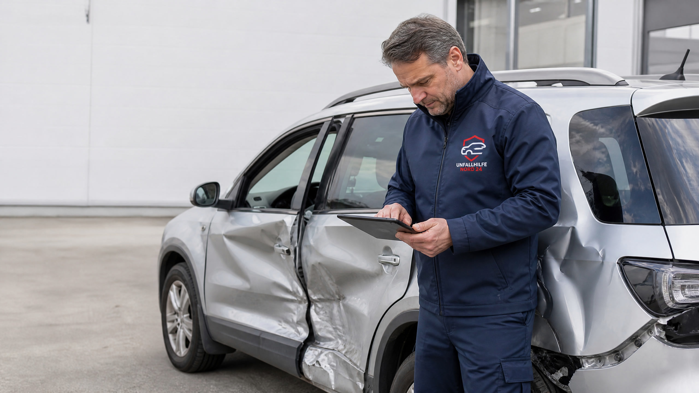

# Kfz-Gutachten bei Totalschaden: Was bedeuten Wiederbeschaffungswert und Restwert?

Nach einem schweren Verkehrsunfall steht häufig eine zentrale Frage im Raum: Lohnt sich die Reparatur noch oder liegt ein Totalschaden vor? Ein Kfz-Gutachten schafft hier die notwendige Grundlage. Es bewertet nicht nur die sichtbaren Beschädigungen, sondern stellt die voraussichtlichen Reparaturkosten dem Wiederbeschaffungswert und dem Restwert des Fahrzeugs gegenüber.

Für viele Unfallgeschädigte ist die Abrechnung eines Totalschadens schwer verständlich. Warum wird vom Fahrzeugwert noch ein Restwert abgezogen? Wann darf das Auto trotzdem repariert werden? Und welches Angebot der Versicherung ist tatsächlich maßgeblich? Dieser Ratgeber erklärt die wichtigsten Begriffe, zeigt eine Beispielrechnung und beschreibt, worauf Sie nach einem Unfall achten sollten.

> **Das Wichtigste auf einen Blick**
> - Ein wirtschaftlicher Totalschaden liegt vor, wenn eine Reparatur im Verhältnis zum Wert des Fahrzeugs nicht mehr wirtschaftlich erscheint.
> - Bei der üblichen Totalschadenabrechnung wird der Restwert vom Wiederbeschaffungswert abgezogen.
> - Der Wiederbeschaffungswert beschreibt, was ein vergleichbares Fahrzeug kosten würde; der Restwert betrifft das beschädigte Fahrzeug.
> - Eine Reparatur kann unter bestimmten Voraussetzungen trotz höherer Reparaturkosten möglich sein. Der ADAC nennt hierfür unter anderem eine Grenze von höchstens 130 Prozent des Wiederbeschaffungswerts, eine vollständige Reparatur und eine Weiternutzung von mindestens sechs Monaten. [1]
> - Lassen Sie das Fahrzeug möglichst vor einer Reparatur oder Veräußerung durch einen unabhängigen Kfz-Sachverständigen begutachten.

## Was ist ein wirtschaftlicher Totalschaden?

Von einem wirtschaftlichen Totalschaden spricht man, wenn die voraussichtlichen Reparaturkosten höher sind als der wirtschaftliche Nutzen einer Reparatur. Entscheidend ist dabei nicht allein, ob das Auto technisch reparierbar wäre. Viele Fahrzeuge lassen sich technisch wieder instand setzen. Die Frage lautet vielmehr, ob die Reparaturkosten im Verhältnis zu den Kosten für ein vergleichbares Ersatzfahrzeug vertretbar sind.

Ein Kfz-Gutachter vergleicht deshalb mehrere Werte. Er kalkuliert zunächst die voraussichtlichen Reparaturkosten. Danach ermittelt er den Wiederbeschaffungswert und den Restwert. Aus diesen Angaben ergibt sich, welche Variante für die Schadenregulierung grundsätzlich relevant ist.

Auch ein **technischer Totalschaden** ist möglich. Er liegt vor, wenn das Fahrzeug nicht mehr sicher oder fachgerecht repariert werden kann, etwa wegen eines irreparablen Rahmenschadens. Bei einem **wirtschaftlichen Totalschaden** wäre eine Reparatur technisch zwar möglich, aber im Verhältnis zum Fahrzeugwert zu teuer. Beide Fälle können zu einer Totalschadenabrechnung führen, die Begründung ist jedoch unterschiedlich.

## Welche Werte stehen im Kfz-Gutachten?

Die drei wichtigsten Größen bei einem Totalschaden sind Reparaturkosten, Wiederbeschaffungswert und Restwert. Sie dürfen nicht miteinander verwechselt werden.

| Begriff | Bedeutung |
|---|---|
| Reparaturkosten | Voraussichtliche Kosten, um das beschädigte Fahrzeug fachgerecht instand zu setzen. |
| Wiederbeschaffungswert | Betrag, der benötigt wird, um ein vergleichbares Fahrzeug auf dem regionalen Markt zu beschaffen. |
| Restwert | Wert, den das beschädigte Fahrzeug im unreparierten Zustand noch hat. |
| Wiederbeschaffungsaufwand | Wiederbeschaffungswert abzüglich Restwert. |
| Wiederbeschaffungsdauer | Zeitraum, der voraussichtlich benötigt wird, um ein vergleichbares Fahrzeug zu finden und zu erwerben. |
| Wiederherstellungswert | Je nach Gutachten und Bewertungsanlass kann damit der Wert eines instand gesetzten oder besonderen Fahrzeugs gemeint sein; die konkrete Definition sollte im Gutachten geprüft werden. |

Der Wiederbeschaffungswert ist nicht automatisch identisch mit dem früheren Kaufpreis. Maßgeblich ist, was ein vergleichbares Fahrzeug zum Zeitpunkt des Unfalls kostet. Alter, Kilometerstand, Ausstattung, Pflegezustand, regionale Marktpreise und dokumentierte Vorschäden können die Bewertung beeinflussen.

Der Restwert ist ebenfalls keine beliebige Zahl. Er soll den Marktwert des beschädigten Fahrzeugs im unreparierten Zustand abbilden. Im Gutachten werden dafür je nach Fall konkrete Händler- oder Verwertungsangebote, der regionale Markt und der Zustand des Fahrzeugs berücksichtigt.

## Wie wird ein Totalschaden abgerechnet?

Bei der klassischen Totalschadenabrechnung wird der Restwert vom Wiederbeschaffungswert abgezogen. Der Grundgedanke ist, dass der Geschädigte den Betrag erhält, der erforderlich ist, um den bisherigen Zustand durch die Beschaffung eines vergleichbaren Fahrzeugs wiederherzustellen. Das beschädigte Fahrzeug bleibt dabei grundsätzlich als Restwertposition bestehen.

Ein vereinfachtes Beispiel:

| Position | Betrag |
|---|---:|
| Wiederbeschaffungswert | 12.000 Euro |
| Abzüglich Restwert | – 3.000 Euro |
| Wiederbeschaffungsaufwand | 9.000 Euro |

In diesem Beispiel beträgt der rechnerische Wiederbeschaffungsaufwand 9.000 Euro. Ob zusätzlich weitere Schadenspositionen wie Abschleppkosten, Standkosten, An- und Abmeldung, Nutzungsausfall oder Mietwagen berücksichtigt werden, hängt von den Umständen des Einzelfalls, der Haftung und der konkreten Schadenabwicklung ab.

§ 249 BGB bildet die allgemeine Grundlage dafür, dass der Zustand hergestellt werden soll, der ohne das schädigende Ereignis bestehen würde. Statt einer tatsächlichen Wiederherstellung kann der erforderliche Geldbetrag verlangt werden. Umsatzsteuer wird bei einer Sachbeschädigung grundsätzlich nur berücksichtigt, soweit sie tatsächlich angefallen ist. [2]

## Was bedeutet die 130-Prozent-Regel?

Die sogenannte 130-Prozent-Regel beschreibt eine Ausnahme, bei der eine Reparatur trotz eines wirtschaftlichen Totalschadens möglich sein kann. Nach der vom ADAC zusammengefassten Orientierung dürfen die Reparaturkosten den Wiederbeschaffungswert höchstens um 30 Prozent übersteigen. Zusätzlich muss das Fahrzeug vollständig und fachgerecht nach den Vorgaben des Gutachtens repariert werden. Außerdem muss der Geschädigte das Fahrzeug anschließend mindestens sechs Monate weiter nutzen. [1]

Die Regel ist kein pauschaler Anspruch auf eine teurere Reparatur. Ob die Voraussetzungen erfüllt sind, hängt vom konkreten Schaden, der Reparaturqualität, der Nutzung und der Haftungssituation ab. Eine bloße Teilreparatur oder eine Reparatur ohne nachvollziehbare Dokumentation kann problematisch sein.

Beispiel:

| Position | Betrag |
|---|---:|
| Wiederbeschaffungswert | 10.000 Euro |
| Reparaturkosten | 12.500 Euro |
| 130 Prozent des Wiederbeschaffungswerts | 13.000 Euro |

Die Reparaturkosten liegen in diesem Beispiel zwar über dem Wiederbeschaffungswert, aber noch unter 130 Prozent. Das allein reicht jedoch nicht aus. Die weiteren Voraussetzungen müssen ebenfalls erfüllt sein. Bei einer konkreten Entscheidung sollten das Gutachten, die Reparaturplanung und die versicherungsrechtliche Situation geprüft werden.

## Warum ist der Restwert im Kfz-Gutachten so wichtig?

Der Restwert wirkt sich unmittelbar auf die Höhe der Totalschadenentschädigung aus. Je höher der angesetzte Restwert ist, desto geringer fällt der Wiederbeschaffungsaufwand aus. Deshalb sollte der Restwert nachvollziehbar ermittelt und im Gutachten dokumentiert werden.

Problematisch kann es werden, wenn die Versicherung nachträglich ein deutlich höheres Restwertangebot vorlegt. Ob ein solches Angebot berücksichtigt werden muss, hängt unter anderem davon ab, wann es vorgelegt wurde, ob es konkret und seriös ist und ob der Geschädigte das Fahrzeug bereits auf Grundlage des Gutachtens veräußert hat. Eine pauschale Antwort ist hier nicht möglich.

Aus diesem Grund sollten Sie das beschädigte Fahrzeug nicht vorschnell verkaufen, verschrotten oder verbindlich an einen Händler abgeben. Lassen Sie zunächst klären, ob das Gutachten vollständig ist und welche Restwertangebote tatsächlich zugrunde liegen. Bei Streit über den Restwert kann eine verkehrsrechtliche Beratung sinnvoll sein.

## Wie wird der Wiederbeschaffungswert ermittelt?

Der Gutachter sucht kein theoretisches Wunschfahrzeug, sondern bewertet, was ein vergleichbares Auto zum Unfallzeitpunkt realistisch kosten würde. Berücksichtigt werden typischerweise Marke und Modell, Erstzulassung, Laufleistung, Motorisierung, Getriebe, Ausstattung, Pflegezustand, Wartungshistorie und regionale Marktsituation.

Sonderausstattung kann den Wert erhöhen. Dazu können beispielsweise ein hochwertiges Navigationssystem, Assistenzsysteme, eine besondere Innenausstattung, Anhängerkupplung oder ein spezielles Fahrwerk gehören. Auch ein außergewöhnlich guter Pflegezustand oder eine lückenlose Wartungshistorie können für die Bewertung relevant sein.

Umgekehrt können Vorschäden, Reparaturstau, Rost, abgefahrene Reifen oder fehlende Wartungsnachweise den Wert mindern. Deshalb sollten Fahrzeughalter dem Sachverständigen alle verfügbaren Unterlagen zur Verfügung stellen. Dazu gehören Kaufvertrag, Serviceheft, Werkstattrechnungen, HU-Berichte, Fotos und Nachweise über nachgerüstete Ausstattung.

## Was sollten Unfallgeschädigte direkt nach dem Totalschaden tun?

Sichern Sie zunächst die Beweise. Fotografieren Sie das Fahrzeug aus verschiedenen Perspektiven und halten Sie Unfallort, Schäden, Fahrzeugposition und gegebenenfalls herumliegende Fahrzeugteile fest. Wenn das Fahrzeug nicht verkehrssicher ist, sollte es nicht weiter gefahren werden.

Beauftragen Sie anschließend einen unabhängigen Kfz-Sachverständigen oder klären Sie, welcher Gutachter den Schaden fachgerecht aufnehmen kann. Bei einem größeren Haftpflichtschaden ist ein unabhängiges Schadengutachten häufig sinnvoll, weil es die Schadenhöhe, die Werte und die wirtschaftliche Einordnung zusammenführt.

Warten Sie mit der Reparatur, dem Verkauf oder der Verschrottung, bis der Zustand ausreichend dokumentiert und die weitere Vorgehensweise geklärt ist. Informieren Sie die gegnerische Versicherung, ohne vorschnell eine endgültige Erklärung zur Schadenhöhe oder eine Abfindung zu unterschreiben.

Wenn die Schuldfrage unklar ist, die Versicherung den Schaden kürzt oder ein hoher Restwert angesetzt wird, kann eine Rechtsanwältin oder ein Rechtsanwalt mit Erfahrung im Verkehrsrecht die Ansprüche prüfen. Das gilt auch bei Leasingfahrzeugen und finanzierten Fahrzeugen, weil zusätzlich Rechte des Leasinggebers oder der finanzierenden Bank betroffen sein können.

## Welche Fehler treten bei Totalschäden besonders häufig auf?

Ein häufiger Fehler ist, nur auf die Reparaturkostensumme zu schauen. Erst der Vergleich mit Wiederbeschaffungswert und Restwert zeigt, wie der Schaden wirtschaftlich einzuordnen ist. Ebenso problematisch ist es, ein Fahrzeug vor der Begutachtung zu zerlegen oder zu verkaufen. Dadurch können wichtige Beweise verloren gehen.

Manche Geschädigte übernehmen außerdem ungeprüft die Werte aus der ersten Versicherungsberechnung. Die Versicherung darf den Schaden prüfen, ihre Berechnung ist aber nicht automatisch die einzige mögliche Bewertung. Vergleichen Sie deshalb Gutachten, Restwertangebote und Regulierungsschreiben sorgfältig miteinander.

Auch die Entscheidung für oder gegen eine Reparatur sollte nicht allein aus einem Bauchgefühl heraus getroffen werden. Persönliche Gründe – etwa die lange bekannte Fahrzeughistorie oder eine besondere Ausstattung – können eine Reparatur nachvollziehbar machen. Gleichzeitig müssen die rechtlichen und wirtschaftlichen Voraussetzungen erfüllt sein.

## Häufige Fragen zum Kfz-Gutachten bei Totalschaden

### Wer zahlt das Gutachten bei einem unverschuldeten Totalschaden?

Bei einem unverschuldeten Verkehrsunfall muss grundsätzlich die gegnerische Haftpflichtversicherung die erforderlichen Kosten eines Sachverständigengutachtens übernehmen. Entscheidend sind unter anderem die Haftung, die Erforderlichkeit des Gutachtens und die Angemessenheit der Kosten. Bei einem eindeutig kleinen Schaden kann ein umfangreiches Gutachten anders bewertet werden als bei einem möglichen Totalschaden.

### Darf ich mein beschädigtes Auto behalten?

Bei der Totalschadenabrechnung bleibt das beschädigte Fahrzeug häufig beim Eigentümer. Dann wird sein Restwert vom Wiederbeschaffungswert abgezogen. Bevor Sie das Fahrzeug behalten, verkaufen oder reparieren lassen, sollten Sie jedoch prüfen, welche Folgen dies für die Regulierung und die Verwertung hat.

### Muss ich das höchste Restwertangebot annehmen?

Das lässt sich nicht allgemein beantworten. Relevant sind Zeitpunkt, Konkretheit, Seriosität und Zugänglichkeit des Angebots sowie die bisherigen Schritte des Geschädigten. Bei einem abweichenden Restwertangebot der Versicherung sollten Sie die Unterlagen prüfen lassen, bevor Sie das Fahrzeug veräußern.

### Kann ich trotz Totalschaden reparieren lassen?

Unter bestimmten Voraussetzungen kann eine Reparatur zulässig sein. Als wichtige Orientierung gilt, dass die Reparaturkosten den Wiederbeschaffungswert nicht um mehr als 30 Prozent übersteigen dürfen. Das Fahrzeug muss vollständig nach Gutachten repariert und anschließend in der Regel mindestens sechs Monate weiter genutzt werden. [1]

### Was passiert mit einem Leasingfahrzeug?

Bei einem Leasingfahrzeug können Eigentums- und Abrechnungsfragen beim Leasinggeber liegen. Melden Sie den Schaden deshalb nicht nur der Versicherung, sondern informieren Sie auch die Leasinggesellschaft und prüfen Sie den Leasingvertrag. Eine Auszahlung an die falsche Person kann zu zusätzlichen Problemen führen.

## Fazit: Das Kfz-Gutachten entscheidet über die richtige Einordnung

Bei einem möglichen Totalschaden ist ein Kfz-Gutachten die wichtigste Grundlage, um die wirtschaftlichen Folgen des Unfalls zu verstehen. Reparaturkosten, Wiederbeschaffungswert und Restwert zeigen, ob eine Reparatur sinnvoll erscheint oder eine Totalschadenabrechnung naheliegt.

Die klassische Abrechnung lautet: Wiederbeschaffungswert minus Restwert. Eine Reparatur kann in bestimmten Fällen trotzdem möglich sein, insbesondere wenn die Voraussetzungen der 130-Prozent-Regel erfüllt sind. Weil Restwert, Fahrzeugwert und Reparaturumfang erhebliche Auswirkungen auf die Entschädigung haben, sollten Sie das Gutachten sorgfältig prüfen und keine vorschnellen Entscheidungen treffen.

> **Hinweis:** Dieser Beitrag dient der allgemeinen Information und ersetzt keine individuelle Rechtsberatung, technische Untersuchung oder verbindliche Schadenberechnung. Maßgeblich sind die Umstände des Einzelfalls, die Haftungsquote, die Versicherungsbedingungen und die aktuelle Rechtsprechung.

## Quellen

[1]: https://www.adac.de/rund-ums-fahrzeug/unfall-schaden-panne/unfall/ansprueche-nach-verkehrsunfall/ "ADAC: Verkehrsunfall in Deutschland – Das zahlt die gegnerische Versicherung, abgerufen am 29.08.2026"

[2]: https://www.gesetze-im-internet.de/bgb/__249.html "Gesetze im Internet: Bürgerliches Gesetzbuch, § 249 Art und Umfang des Schadensersatzes, abgerufen am 29.08.2026"
