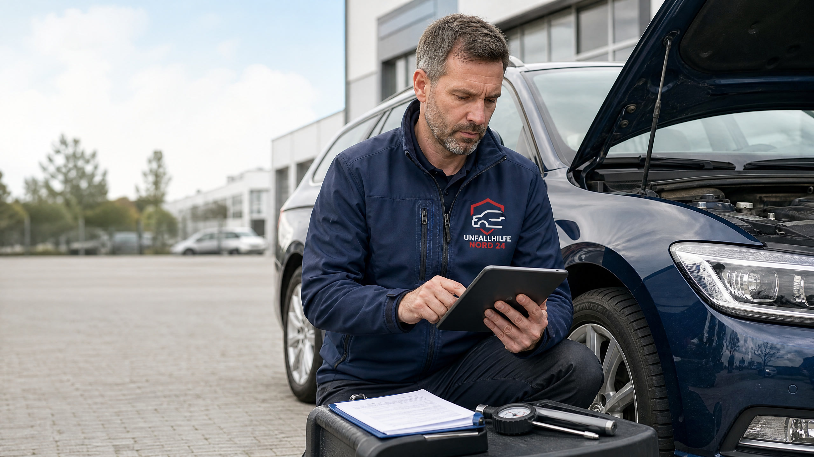

# Kfz-Gutachten beim Gebrauchtwagenkauf: So vermeiden Sie teure Überraschungen

Ein Gebrauchtwagen kann ein gutes Preis-Leistungs-Verhältnis bieten – vorausgesetzt, sein tatsächlicher Zustand entspricht den Angaben des Verkäufers. Genau hier setzt ein Kfz-Gutachten oder professioneller Gebrauchtwagencheck an. Ein unabhängiger Kfz-Sachverständiger untersucht das Fahrzeug vor dem Kauf, dokumentiert Mängel und kann Hinweise auf Unfallschäden, Vorschäden oder eine mögliche Wertminderung geben.

Für Kaufinteressierte stellt sich vor allem eine Frage: **Lohnt sich ein Kfz-Gutachten vor dem Kauf?** Bei einem hochwertigen, älteren oder schwer einzuschätzenden Fahrzeug lautet die Antwort häufig ja. Die Kosten einer Prüfung können deutlich geringer sein als die finanziellen Folgen eines verschwiegenen Unfalls, eines Reparaturstaus oder eines technischen Mangels.

> **Das Wichtigste in Kürze**
> - Ein unabhängiger Gebrauchtwagencheck schafft eine objektivere Entscheidungsgrundlage als die bloße Besichtigung durch Käufer und Verkäufer.
> - Prüfen lassen sollten Sie insbesondere Karosserie, Lack, Fahrwerk, Bremsen, Reifen, Motorraum, Elektronik, Unterboden und mögliche Unfallspuren.
> - Ein Kfz-Gutachten ersetzt weder die Probefahrt noch die Prüfung von Kaufvertrag, Fahrzeugpapieren und Wartungshistorie.
> - Vor dem Kauf sollten Sie sich bekannte Unfallschäden, Vorschäden und Zusicherungen schriftlich im Kaufvertrag bestätigen lassen.
> - Eine professionelle Zustandsdokumentation kann außerdem bei Preisverhandlungen und späteren Streitigkeiten hilfreich sein.

## Was ist ein Kfz-Gutachten beim Gebrauchtwagenkauf?

Ein Kfz-Gutachten beim Gebrauchtwagenkauf ist eine unabhängige technische und optische Bewertung des angebotenen Fahrzeugs. Der Sachverständige untersucht den aktuellen Zustand, dokumentiert erkennbare Mängel und bewertet, ob Hinweise auf frühere Unfälle oder Reparaturen vorhanden sind. Je nach Auftrag kann außerdem eine Einschätzung des Fahrzeugwerts oder der festgestellten Wertminderung erfolgen.

Im Unterschied zu einer Hauptuntersuchung geht es beim Gebrauchtwagencheck nicht nur darum, ob das Fahrzeug die gesetzlichen Mindestanforderungen für den Straßenverkehr erfüllt. Eine bestandene HU bedeutet daher nicht automatisch, dass das Auto frei von Unfallschäden, Verschleiß oder wirtschaftlichen Risiken ist. TÜV NORD beschreibt einen professionellen AutoKaufCheck als unabhängige Prüfung, die unter anderem technische Mängel, Unfall- und Vorschäden sowie Wertminderungen erfassen kann. [2]

Das Gutachten beantwortet vor allem drei Fragen: **Welchen Zustand hat das Fahrzeug tatsächlich? Welche Reparaturen oder Investitionen sind absehbar? Und passt der verlangte Kaufpreis zum ermittelten Zustand?**

## Wann lohnt sich ein Gebrauchtwagen-Gutachten?

Ein Gutachten ist besonders sinnvoll, wenn Sie die Vorgeschichte des Fahrzeugs nicht vollständig nachvollziehen können oder wenn es um eine größere Investition geht. Das gilt beispielsweise bei einem älteren Fahrzeug mit hoher Laufleistung, einem Importfahrzeug, einem sportlichen Modell, einem Oldtimer oder einem Auto mit auffällig niedrigem Verkaufspreis.

Auch bei privaten Verkäufen kann ein neutraler Check hilfreich sein. Käufer und Verkäufer haben häufig unterschiedliche Interessen und Einschätzungen. Ein unabhängiger Sachverständiger schafft eine sachliche Gesprächsgrundlage, ohne automatisch die Position einer Vertragspartei zu übernehmen.

Ein professioneller Check ist außerdem empfehlenswert, wenn das Fahrzeug bereits sichtbare Lackunterschiede, ungleichmäßige Spaltmaße, Warnmeldungen, ungewöhnliche Geräusche oder eine unklare Servicehistorie aufweist. Solche Auffälligkeiten sind nicht automatisch ein Beweis für einen Unfallschaden, sollten aber fachlich eingeordnet werden.

| Situation beim Fahrzeugkauf | Nutzen eines Kfz-Gutachtens |
|---|---|
| Älteres Fahrzeug mit hoher Laufleistung | Erkennen von Reparaturstau und absehbaren Folgekosten |
| Unklare oder lückenhafte Fahrzeughistorie | Prüfung auf Widersprüche, Vorschäden und fehlende Nachweise |
| Hochpreisiges oder seltenes Fahrzeug | Absicherung einer größeren Kaufentscheidung |
| Importfahrzeug oder Fahrzeug mit vielen Vorbesitzern | Zusätzliche Zustands- und Plausibilitätsprüfung |
| Sichtbare Lack- oder Karosserieauffälligkeiten | Einordnung möglicher Reparaturen oder Unfallschäden |
| Kauf von einer Privatperson | Neutralere Grundlage für Preis und Vertragsangaben |

## Was prüft ein Kfz-Sachverständiger vor dem Kauf?

Der genaue Umfang hängt vom Auftrag und vom Fahrzeug ab. Ein seriöser Gebrauchtwagencheck betrachtet jedoch nicht nur den Lack, sondern das Auto als Gesamtsystem. Bei der Karosserie werden unter anderem Lackbild, Spaltmaße, Verformungen, Korrosion und sichtbare Reparaturspuren geprüft. Unterschiedliche Lackstärken oder ungleichmäßige Übergänge können Hinweise auf nachlackierte Bauteile geben.

Im Motorraum und unter dem Fahrzeug können Flüssigkeitsverluste, beschädigte Leitungen, Korrosion oder frühere Reparaturen auffallen. Fahrwerk, Lenkung, Bremsen und Reifen liefern wichtige Hinweise auf Sicherheit und zu erwartenden Wartungsaufwand. Bei einer Probefahrt lassen sich zusätzlich Geräusche, Schaltverhalten, Bremsreaktionen, Geradeauslauf und ungewöhnliche Vibrationen beurteilen.

Bei modernen Fahrzeugen ist die Elektronik besonders relevant. Warnleuchten, Fehlerspeicher, Assistenzsysteme, Klimaanlage, Beleuchtung, Infotainment und elektrische Komfortfunktionen sollten geprüft werden. Bei Elektro- und Hybridfahrzeugen können zusätzlich Hochvoltsystem, Ladefunktion und – abhängig vom Prüfauftrag – der Zustand der Antriebsbatterie von Bedeutung sein.

Ein Gutachten kann nicht jede zukünftige Reparatur vorhersagen. Es dokumentiert den Zustand zum Zeitpunkt der Prüfung und weist auf erkennbare Risiken hin. Verdeckte Mängel, die ohne Demontage oder spezielle Diagnose nicht feststellbar sind, sollten im Bericht ausdrücklich als Prüfgrenze genannt werden.

## Unfallwagen erkennen: Welche Hinweise sind wichtig?

Reparierte Unfallschäden sind bei Gebrauchtwagen nicht grundsätzlich problematisch. Entscheidend ist, ob der Schaden fachgerecht behoben, vollständig dokumentiert und im Kaufpreis angemessen berücksichtigt wurde. Problematisch wird es, wenn Unfallschäden verschwiegen, verharmlost oder unvollständig beschrieben werden.

Achten Sie auf unterschiedliche Farbtöne zwischen angrenzenden Bauteilen, ungleichmäßige Spaltmaße, Lacknebel an Dichtungen, neue Schrauben, unübliche Schweißstellen oder Abweichungen zwischen Fahrzeugzustand und Wartungsunterlagen. Auch eine ungewöhnlich neue Front an einem ansonsten stark gebrauchten Fahrzeug kann eine genauere Prüfung rechtfertigen.

Der ADAC empfiehlt, ausdrücklich nach Unfallschäden zu fragen. Nach den dort dargestellten Hinweisen muss ein privater Verkäufer bekannte Unfallschäden offenlegen; ein Händler muss über Unfallschäden informieren und das Fahrzeug vor dem Verkauf zumindest auf erkennbare Schäden untersuchen. Reparierte Unfallschäden können den Wert des Fahrzeugs mindern. [1]

Eine Sichtprüfung durch einen Sachverständigen ist keine Garantie, dass jeder frühere Schaden entdeckt wird. Sie erhöht jedoch die Wahrscheinlichkeit, Auffälligkeiten rechtzeitig zu erkennen und gezielte Fragen zu stellen. Lassen Sie sich bekannte Schäden, Reparaturen und Zusicherungen zusätzlich schriftlich im Kaufvertrag festhalten.

## Welche Unterlagen sollten vor dem Kauf geprüft werden?

Ein Kfz-Gutachten ist nur ein Teil der Kaufprüfung. Ebenso wichtig sind Fahrzeugpapiere, Wartungsnachweise und die Identität des Fahrzeugs. Prüfen Sie, ob die Fahrgestellnummer am Fahrzeug mit den Angaben in den Papieren übereinstimmt. Abweichungen sollten vor dem Kauf vollständig geklärt werden.

Das Serviceheft, digitale Wartungsnachweise, HU-Berichte und Werkstattrechnungen zeigen, ob die Wartung plausibel dokumentiert ist. Fehlen wichtige Nachweise, muss das nicht zwingend auf einen Mangel hindeuten. Es erhöht aber das Risiko, dass Wartungen nicht durchgeführt oder Reparaturen nicht vollständig offengelegt wurden.

Der ADAC weist außerdem darauf hin, dass die Aussage „scheckheftgepflegt“ nicht automatisch bedeutet, dass sämtliche Wartungsarbeiten erledigt wurden. Bei digitalen Serviceheften sollten Käufer sich die Wartungshistorie ausdrucken und passende Werkstattbelege verlangen. [1]

| Unterlage | Was Sie prüfen sollten |
|---|---|
| Zulassungsbescheinigung Teil I und II | Fahrzeugdaten, Halterangaben und Übereinstimmung mit der FIN |
| Serviceheft oder digitale Wartungshistorie | Inspektionen, Kilometerstände und Werkstattangaben |
| HU-Berichte | Prüftermine, festgestellte Mängel und Kilometerstand |
| Werkstattrechnungen | Durchgeführte Reparaturen und Austausch wichtiger Bauteile |
| Kaufvertrag | Unfallfreiheit, bekannte Mängel, Zusicherungen und Zubehör |
| Schlüssel und Zubehör | Anzahl der Schlüssel, Räder, Ladekabel und Sonderausstattung |

## Wie läuft ein Kfz-Gutachten vor dem Autokauf ab?

Idealerweise vereinbaren Sie die Prüfung, bevor Sie einen verbindlichen Kaufvertrag unterschreiben oder eine nicht rückzahlbare Anzahlung leisten. Stimmen Sie mit dem Verkäufer ab, dass das Fahrzeug dem Sachverständigen vollständig zugänglich ist. Eine Begutachtung sollte bei ausreichendem Tageslicht oder in einer geeigneten Prüfhalle stattfinden; ein stark verschmutztes oder nasses Fahrzeug kann die Beurteilung der Karosserie erschweren.

Der Sachverständige nimmt die Fahrzeugdaten auf, prüft den sichtbaren Zustand, dokumentiert Auffälligkeiten und führt – sofern vereinbart – eine Probefahrt oder technische Diagnose durch. Anschließend erhalten Sie einen Zustandsbericht oder ein Gutachten. Darin sollten festgestellte Mängel, Prüfgrenzen, Vorschäden und gegebenenfalls eine Einschätzung zur Wertminderung verständlich beschrieben sein.

Planen Sie für die Prüfung ausreichend Zeit ein und nehmen Sie die Ergebnisse ernst. Ein einzelner kleiner Mangel muss nicht gegen den Kauf sprechen. Mehrere mittlere Mängel, eine unklare Historie und ein nicht nachvollziehbarer Preis können zusammen jedoch ein erhebliches Risiko ergeben.

## Gutachten, Werkstattcheck oder HU: Was ist der Unterschied?

Die Begriffe werden im Alltag häufig vermischt, verfolgen aber unterschiedliche Ziele. Eine HU prüft, ob das Fahrzeug zum Prüfzeitpunkt die gesetzlichen Anforderungen erfüllt. Ein Werkstattcheck konzentriert sich häufig auf technische Funktionen und Wartungsbedarf. Ein Kfz-Gutachten kann zusätzlich Unfall- und Vorschäden, Zustandsdokumentation, Wertminderung und die Plausibilität des Gesamtbilds bewerten.

| Prüfung | Hauptzweck | Typische Grenze |
|---|---|---|
| Hauptuntersuchung | Verkehrssicherheit und gesetzliche Vorgaben | Keine umfassende Kaufberatung oder Wertanalyse |
| Werkstattcheck | Technischer Zustand und Wartungsbedarf | Umfang hängt stark von der Werkstatt ab |
| Probefahrt | Fahrverhalten und subjektive Auffälligkeiten | Nicht alle Schäden sind während der Fahrt erkennbar |
| Kfz-Gutachten | Unabhängige Zustands-, Schaden- und Wertbewertung | Ergebnis bezieht sich auf den Prüfzeitpunkt und vereinbarten Umfang |

Für eine Kaufentscheidung kann die Kombination aus Unterlagenprüfung, Probefahrt und unabhängigem Gebrauchtwagencheck am aussagekräftigsten sein. Keine einzelne Prüfung ersetzt alle anderen Bausteine.

## Kann ein Gutachten beim Preisverhandeln helfen?

Ja, ein nachvollziehbarer Zustandsbericht kann eine sachliche Preisverhandlung unterstützen. Entscheidend ist, dass die festgestellten Mängel realistisch bewertet werden. Nicht jeder Mangel kann einfach Euro für Euro vom Kaufpreis abgezogen werden, weil Reparaturkosten, Fahrzeugwert, Dringlichkeit und Marktpreis zusammen betrachtet werden müssen.

Ein Sachverständiger kann technische Befunde dokumentieren. Die endgültige Entscheidung, ob der Kaufpreis angepasst, eine Reparatur vor Übergabe vereinbart oder vom Kauf Abstand genommen wird, liegt jedoch bei den Vertragsparteien.

Vereinbaren Sie Reparaturen oder Preisnachlässe schriftlich. Der Kaufvertrag sollte klar festhalten, welche Arbeiten vor der Übergabe erledigt werden, welche Mängel bekannt sind und welche Zusicherungen gelten. Mündliche Versprechen lassen sich später häufig schwer beweisen.

## Häufige Fragen zum Kfz-Gutachten beim Gebrauchtwagenkauf

### Wer beauftragt und bezahlt das Gutachten?

In der Regel beauftragt und bezahlt die kaufinteressierte Person den Gebrauchtwagencheck selbst. Anders als beim unverschuldeten Haftpflichtschaden nach einem Unfall handelt es sich hier normalerweise nicht um einen Schadenersatzanspruch gegen eine gegnerische Versicherung. Kosten und Leistungsumfang sollten vor der Prüfung transparent vereinbart werden.

### Muss der Verkäufer eine Begutachtung zulassen?

Ein Verkäufer muss einer unabhängigen Prüfung nicht in jedem Fall zustimmen. Verweigert er eine nachvollziehbare Besichtigung oder drängt er zu einer schnellen Unterschrift, ist Vorsicht angebracht. Ein seriöser Verkäufer sollte eine angemessene Prüfung des angebotenen Fahrzeugs ermöglichen.

### Ist ein unfallfreies Fahrzeug automatisch mängelfrei?

Nein. Unfallfreiheit sagt nur etwas über die Unfallhistorie aus und ersetzt keine technische Prüfung. Verschleiß, Wartungsstau, Motorschäden oder Elektronikprobleme können auch bei einem unfallfreien Fahrzeug auftreten.

### Reicht ein TÜV-Bericht für den Gebrauchtwagenkauf?

Ein gültiger HU-Bericht ist wichtig, aber kein vollständiger Ersatz für einen Gebrauchtwagencheck. Die HU und ein Kfz-Gutachten verfolgen unterschiedliche Ziele. Der TÜV NORD AutoKaufCheck wird beispielsweise als separate unabhängige Zustandsprüfung vor dem Kauf angeboten. [2]

### Was passiert, wenn der Verkäufer die Prüfung ablehnt?

Sie können vom Kauf Abstand nehmen. Ein Fahrzeugkauf ist freiwillig, und eine verweigerte Prüfung kann – insbesondere zusammen mit einer lückenhaften Historie oder starkem Zeitdruck – ein relevantes Warnsignal sein.

## Fazit: Vor dem Kauf prüfen lassen statt später teuer reparieren

Ein Kfz-Gutachten beim Gebrauchtwagenkauf kann die Entscheidung deutlich sicherer machen. Es dokumentiert den Fahrzeugzustand, hilft beim Erkennen von Unfall- und Vorschäden und macht absehbare Reparaturrisiken sichtbar. Besonders bei teuren, älteren oder historisch schwer nachvollziehbaren Fahrzeugen ist ein unabhängiger Check häufig eine sinnvolle Investition.

Gehen Sie strukturiert vor: Besichtigen Sie das Auto, machen Sie eine Probefahrt, prüfen Sie Fahrzeugpapiere und Wartungsnachweise, lassen Sie das Fahrzeug bei Bedarf unabhängig begutachten und halten Sie alle Zusicherungen im Kaufvertrag fest. Wer sich zu einer schnellen Unterschrift gedrängt fühlt, sollte lieber Abstand nehmen und nach einem besser dokumentierten Fahrzeug suchen.

> **Rechtlicher Hinweis:** Dieser Beitrag dient der allgemeinen Information und stellt keine individuelle Rechtsberatung, technische Diagnose oder verbindliche Wertfeststellung dar. Entscheidend sind der konkrete Kaufvertrag, der Fahrzeugzustand, die Angaben des Verkäufers und die Umstände des Einzelfalls.

## Quellen

[1]: https://www.adac.de/rund-ums-fahrzeug/auto-kaufen-verkaufen/gebrauchtwagenkauf/gebrauchtwagen-kaufen/ "ADAC: Auto gebraucht kaufen – Worauf Sie achten sollten, abgerufen am 31.08.2026"

[2]: https://www.tuev-nord.de/de/dienstleistungen/pruefung-und-gutachten/autokaufcheck/ "TÜV NORD: Gebrauchtwagen vor dem Kauf checken – AutoKaufCheck, abgerufen am 31.08.2026"
